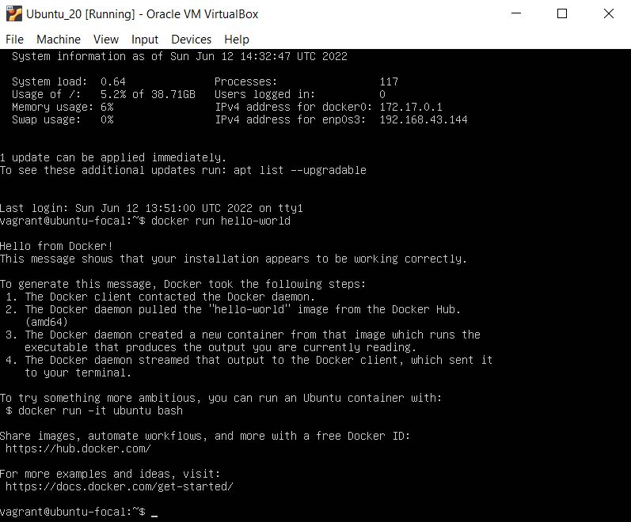
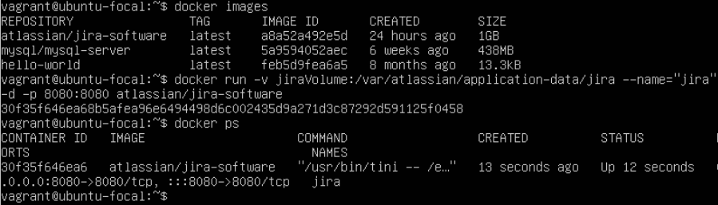
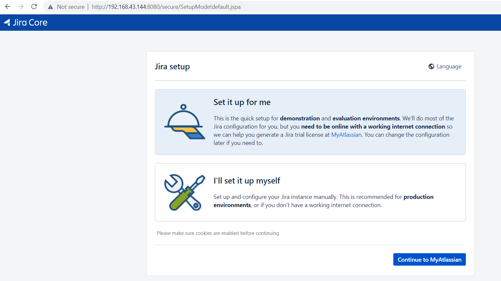
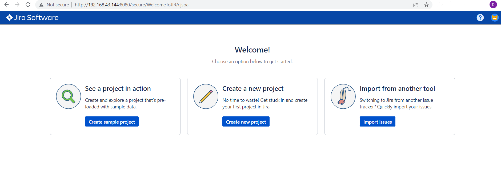
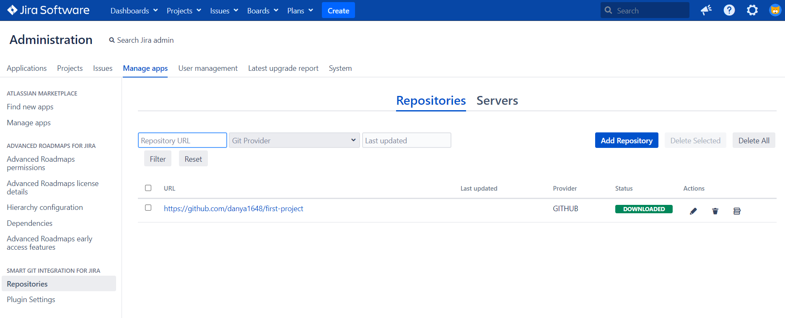
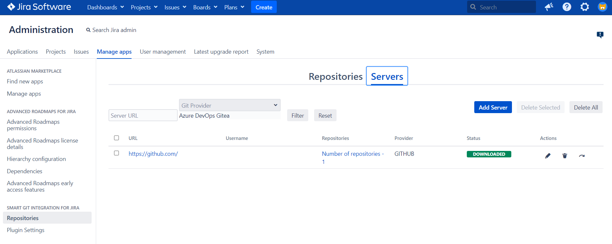

# Jira task

In order to get more familiar with ***Alpha Serve*** software products (*Jira plugins* in particular), the following steps have been performed:

1. Install **Docker Engine** on Linux Ubuntu 20.04 LTS:

2. Create *a new Docker container* based on **the Jira Software image**:

3. Go through **the Jira Software configuration process**:

- *Start* of the setup:

- *Finish* of the setup:

- Long-awaited *result*:

4. Configure a new plugin called ***Smart Git Integration for Jira***:

- Examine the plugin's overview in **Atlassian Marketplace**:

- Set up *GitHub repositories*:

- Connect to *the GitHub server* with the help of **the Personal Access Token (PAT)**:

- Enjoy using it :smile:.

